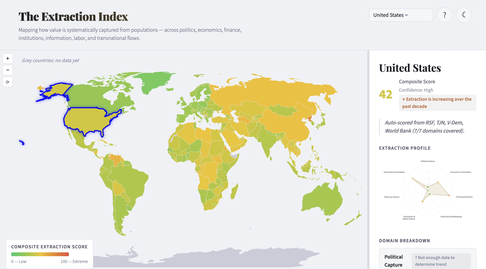

# The Extraction Index

Most countries that top the corruption rankings aren't where the real damage happens. The United States scores well on every major governance index — and yet its citizens face financialized healthcare, decades of wage stagnation despite rising productivity, and a criminal justice system that extracts billions from the poor. None of that registers as "corruption." Almost all of it is perfectly legal.

That's extraction: the systematic capture of value from the many by the few, through institutions that were supposed to serve everyone. And it's happening everywhere, in different shapes, often invisible precisely because no one's breaking the law.

**The Extraction Index makes it visible.** It's an interactive world map that scores every country across seven domains — from political capture to financial secrecy to whether a country helps *other* countries extract from their own populations. Click a country, see where the extraction is concentrated, and watch how the picture changes when you decide which forms of extraction matter most to you.

**[Live Demo](https://curtispoe.org/projects/extraction/)**

## Why seven domains?

Because extraction moves. Block it in one place and it migrates to another — from wage suppression to financialized debt, from political corruption to regulatory complexity. A single score on a single axis can't capture that. A country that looks clean on five axes might be extracting viciously on the other two.

The seven domains: **Political Capture** · **Economic Concentration** · **Financial Extraction** · **Institutional Gatekeeping** · **Information & Media Capture** · **Resource & Labor Extraction** · **Transnational Facilitation**

That last one matters more than you'd think. Some countries barely extract from their own citizens — they exist to help others do it. Without that axis, Luxembourg looks like Denmark. It isn't.

## What you see on the map

Every country gets a composite score from 0 (no measurable extraction) to 100 (extreme extraction), color-coded from pale yellow through amber to deep brown. But the score is only the entry point. Click a country and you get a radar chart showing *where* the extraction is concentrated, per-domain breakdowns with trend arrows (is it getting worse?), and source citations for every number.

You can adjust the weights yourself. Think financial extraction matters more than media capture? Move the sliders. The map redraws in real time. Equal weights are the default because we make no claim that one form of extraction matters more than another — but you might, and the tool respects that.

### The legibility paradox

The most extractive regimes tend to produce the worst data. North Korea is almost certainly more extractive than the United States, but the data behind that claim is far thinner. Rather than hiding this problem, the map shows it: countries with strong data appear in saturated color, countries with sparse data appear faded. You can see the score *and* how much you should trust it, at a glance.

## Where the data comes from

Every score is grounded in published, independent data sources: V-Dem for political indicators, World Bank and ILO for economic and institutional measures, Tax Justice Network for financial secrecy, and Reporters Without Borders for press freedom. The full source registry is in [`sources.md`](sources.md), and every per-country score includes its source citations and a written justification.

## The ground rules

**Extraction is not corruption.** A country can score well on every anti-corruption index and still extract massively through legal channels. That's the whole point.

**No overclaiming.** A low-confidence score honestly labeled is worth more than a precise-looking number backed by nothing. If the data is sparse, we say so.

**Show your work.** Every score has a justification and source citations. The methodology is transparent and the weights are adjustable because reasonable people can disagree about what matters most.

## Background

See [BACKGROUND.md](BACKGROUND.md) for the intellectual history of the project.

## Learn more

**[Methodology](METHODOLOGY.md)** — how scores are calculated, what the confidence levels mean, and the known limitations of the data.

**[Developer Guide](DEVELOPER.md)** — project structure, data pipeline, how to run locally, and how to contribute.

## License

MIT. See [LICENSE](LICENSE).
